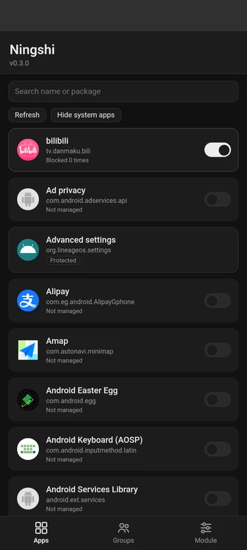
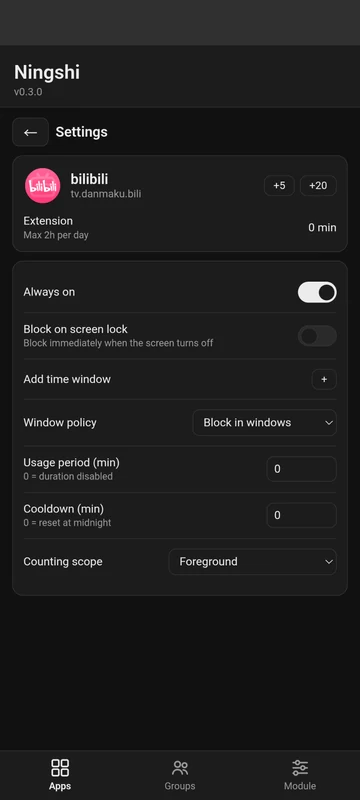

[中文](README.zh.md)

# Ningshi

**Version 0.3.7**

Ningshi (凝时) is a KernelSU module. It helps you scroll less and keeps apps from running in the background.

## Features

- **Kill at launch.** App code is stopped before it runs.
- **Rules.** Always-on, lock-screen block, time windows, duration limit + cooldown; per-app and shared-pool groups.
- **WebUI.** Configure everything in the browser.

## Usage

Each app (or group) can combine four rules:

- **Always on** — block it all the time.
- **Lock screen** — block while the screen is off.
- **Time windows** — block within chosen hours (or allow only within them).
- **Duration** — allow a limited usage time; once used up, it resets the next day, or blocks for a **cooldown** period and then resets automatically.

The **+5 / +20** buttons grant a temporary **extension** (capped daily) for when you really need the app.

## Requirements

- KernelSU, arm64 device
- Kernel with kprobe enabled and the `binder_transaction` symbol in `/proc/kallsyms`

## Screenshots

 

## Development

### Layout

```
.
├── module/                 # flashable module (packaging just zips this directory)
│   ├── module.prop
│   ├── customize.sh        # install checks (arch + symbol)
│   ├── service.sh          # boot watchdog that starts the daemon
│   ├── uninstall.sh        # kills the daemon on uninstall
│   ├── bin/                # built binary (copied in at build time)
│   └── webroot/            # KernelSU WebUI
│       ├── index.html
│       └── config.json
├── daemon/                 # core program (Rust daemon + eBPF)
│   ├── src/                # engine, gate, detection, socket, ...
│   ├── bpf/gate.bpf.c      # kprobe / kretprobe hooks
│   ├── build.sh            # build BPF + cross-compile the daemon
│   └── rules.example.json  # example rules
└── scripts/package.sh      # one-shot build + package
```

### Build

Requires `clang` (for BPF), the Rust toolchain with the `aarch64-unknown-linux-musl` target, and `cargo-zigbuild`.

```bash
cd daemon
./build.sh
# output: target/aarch64-unknown-linux-musl/release/ningshi
```

### Packaging

`scripts/package.sh` does it all: builds the daemon, places the binary in `module/bin/`, and zips `module/` into `ningshi-vX.Y.Z.zip` (`module.prop` sits at the zip root; packaging needs the `zip` command).

### Device testing

```bash
adb push module/bin/ningshi /data/local/tmp/
adb shell su -c 'pkill -9 ningshi; sleep 1; cp /data/local/tmp/ningshi /data/adb/modules/ningshi/bin/ningshi && chmod 755 /data/adb/modules/ningshi/bin/ningshi'
# the watchdog restarts the new binary ~5s later
```

CLI:

```bash
ningshi status                       # status JSON (blocked uids / usage / kill counts)
ningshi reload                       # reload rules.json
ningshi extension <key> <minutes>    # grant a temporary extension
ningshi version
ningshi clear_log
```

### Rules file

`/data/adb/ningshi/rules.json` is the single data contract shared by the WebUI and the daemon; see `daemon/rules.example.json`. Unknown fields are ignored when parsing, for forward compatibility.

### Key design

- **Interception**: the kprobe checks the uid at `binder_transaction` entry; the first non-zero-handle transaction (`attachApplication`) marks the tgid, and the kretprobe emits an event. The userspace killer waits for the process to become the foreground app (`oom_score_adj == 0`, i.e. the attach handshake is complete) and then sends `SIGKILL` through a pidfd, so a recycled pid can never redirect the kill.
- **Detection**: foreground / screen state / package-to-uid are read from kernel filesystems (cpuset / DRM / `packages.list`).
- **Fail-open**: every failed detection lets the app through. A periodic sweep covers any process the gate missed.
